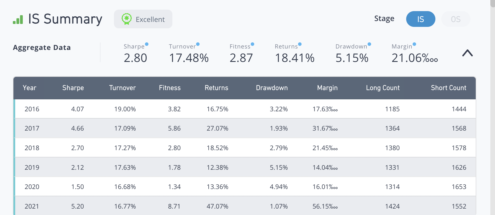

# Data Exploration

asset:
settings:
    * NEUTRALIZATION=None
    * DECAY=0
表示做多

# example 1
* rank(ts_delta(retained_earnings / sharesout, 90))
* rank(ts_delta(retained_earnings / sharesout, 75))
* rank(ts_delta(retained_earnings / sharesout, 60))

# example 2: 量价齐升 / 量价齐降
FAIL REASON：Robust universe returns of 6.69% is below cutoff of 7.36% (40% of Alpha).
中国市场中，不允许做空；
在允许做空情况下，收益率为18.41%。而在不允许做空的情况下，收益率跌至6.69%，不足原来的40%。

* -ts_corr(ts_rank(volume, 10), ts_rank(vwap, 10), 20): 1 FAIL
* -ts_corr(ts_rank(volume, 30), ts_rank(vwap, 30), 20): 3 FAIL
* -ts_corr(ts_rank(volume, 10), ts_rank(vwap, 10), 30): 2 FAIL
* ts_corr(ts_rank(volume, 10), ts_rank(vwap, 10), 20): 6 FAIL

Update:
* 