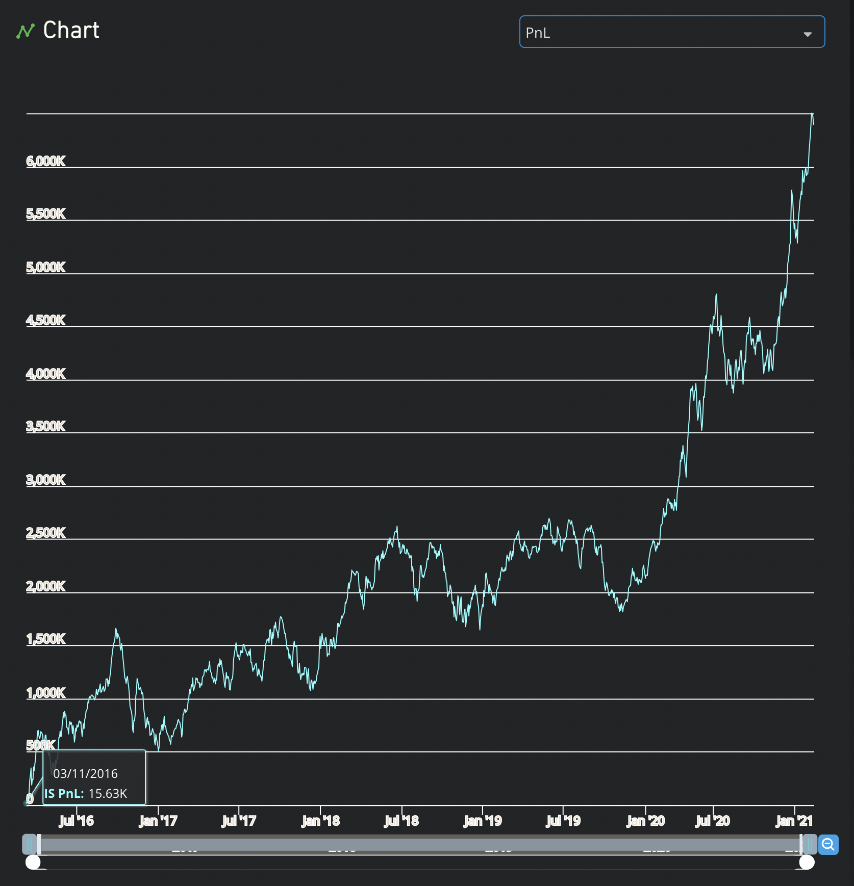

# cross-sectional


# time-series
performs the operation within the stock's won historical values. Analyze how a given variable changes over time.


# Process of developing quantitative ideas
1. Collect data and information
2. Come up with an idea or hypothesis
3. Translate idea into mathematical model (Write codes)
4. Backtest the idea on historical data (Evaluate the performance of your idea)
5. Check for robustness


# Demo of BRAIN
1. The official website: [platform.worldquantbrain.com](platform.worldquantbrain.com)

Key functions on BRAIN
* Simulate: Backtest
* Alphas
* Data
* Competitions
* Team
* Events
* Learn


2. Simulate
* REGION: Set of instruments based on common geography, trading hours, and other attributes
* UNIVERSE: Subset of region based on liquidity; smaller universes are more liquid
* DELAY: Delay=1 alphas trade in the morning using data from yesterday; Delay=0 alphas trade in the evening using data from today

**class test**

* code: 
```bash
rank(mdf_rds)
```
* settings:


* Explanation
R&D Expense表示研发费用，研发费用占上市公司利润的比例；倒排Top3000的按照0到1作策略分配

result:



# Questions
1. Why changing the NEUTRALIZATION will affect the result?
