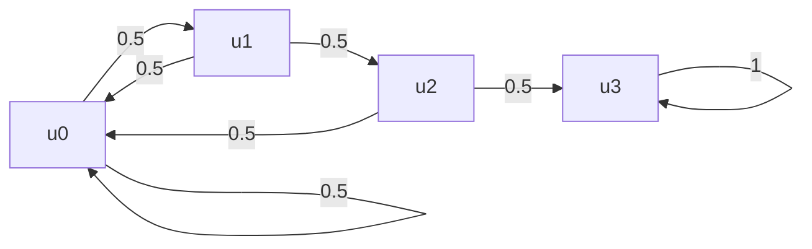
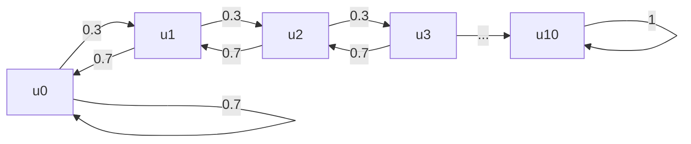

# Introduction

在这篇文章中，主要探讨如何求一些事件的期望步长(最小步长)。其中，主要涉及如何书写Markov概率图，并从概率图求出相应的转移矩阵和利用转移矩阵求解期望。

# Questions

1. 连续投掷硬币，直到连续三次出现正面朝上则停止，记Y为所需投掷硬币的次数，求$E(Y)$.

2. 假设装备强化率是30%， 若强化失败，则强化等级掉1级；求问，将该装备强化到10级，需要强化多少次？

3. 击败BOSS, 可能掉落套装A的所有装备，若套装A一共包含4个部位，每件装备的掉率均为10%，每次只掉落一件装备，求问玩家集齐套装A需要击败BOSS多少次。

# Question 1

## Method 1.1： 线性方程解法

我们假设硬币是均匀的，那么每一次的投掷结果是

$$X_i  = 
\left\{ \begin{aligned}
1,\ & p = 0.5\\
0,\ & p = 0.5
\end{aligned}
\right.$$

* 由于单次投掷硬币有且只有两个结果，为了方便，定义正面朝上为1， 反面朝上为0.

* 定义，$h_i = P_i(hit\ \{111\})$表示从状态$i$开始，抵达状态$\{111\}$三个正面朝上的概率, $\mu_i = E_i(time\ to\ hit\ \{111\})$表示从状态$i$开始，抵达$\{111\}$三个正面朝上的最小时间(即为投掷次数)。

a. 假设当前在状态$3$, 显然从状态$3$转移到状态$3$的概率$h_3 = 1$并且从从状态$3$转移到状态$3$的步长为$0$

$$
h_3 = 1, \quad \mu_3 = 0
$$

b. 假设当前在状态$0$, 从状态$0$出发，有两个结果，分别是有$0.5$的概率到达状态$0$或者有$0.5$的概率到达状态$1$. 则有

$$
h_0 = 0.5 h_0 + 0.5 h_1, \quad \mu_0 = 1 + 0.5\mu_0 + 0.5\mu_1
$$

c. 类似的，我们可以书写出其他等式

$$\mu_i  = 
\left\{ \begin{aligned}
1 + \sum_{j=1}^i p_j\mu_j\\
0,
\end{aligned}
\right.$$

化作线性方程组形式:

$$
\begin{cases}
\mu_0 = 1 + 0.5\mu_0 + 0.5\mu_1 \\
\mu_1 = 1 + 0.5 \mu_0 + 0.5\mu_2 \\
\mu_2 = 1 + 0.5 \mu_0 + 0.5\mu_3 \\
\mu_3 = 0
\end{cases}
$$

求解如下:

$$
\begin{aligned}
\because & \quad \mu_3 = 0 \Rightarrow \mu_2 = 1 + p\mu_0 \\
\therefore & \quad \mu_1 = 1 + p\mu_0 + p(1+\mu_0) = 1+p + p\mu_0 + p^2\mu_0 \\
\therefore & \quad \mu_0 =  1 + p + p^2 + p\mu_0 + p^2\mu_0 + p^3\mu_0
\end{aligned}
$$

$$
\begin{aligned}
(1-p-p^2-p^3) \mu_0 & = 1 + p + p^2 \\
\mu_0 = 14
\end{aligned}
$$

$\therefore$, $\mu_1 = 12$, $\mu_2 = 8$

## Method 1.2 转移矩阵

通过概率图或者状态方程，易得相应的概率转移矩阵$P$ (transition matrix)

$$
P = \begin{pmatrix}
0.5 & 0.5 & 0.5 & 0\\
0.5 & 0 & 0 & 0 \\
0 & 0.5 & 0 & 0 \\
0 & 0 & 0.5 & 1 
\end{pmatrix}
$$

    性质1：
    记状态E为吸收态，记Q为P的一个子矩阵且Q为将P中关于吸收态E的行与列去掉后所得到的子式。

在这个问题中，我们的目标状态是抵达$\{111\}$, 这样的目标状态，我们称之为**吸收态**，其对应着第4行与第4列。将与吸收态$\{111\}$相关的行列去掉到，我们得到如下子矩阵$Q$:

$$
Q = \begin{pmatrix}
0.5 & 0.5 & 0.5\\
0.5 & 0 & 0 \\
0 & 0.5 & 0
\end{pmatrix}
$$

    性质2：
    矩阵N = inv(I-Q)称为P的基础矩阵。其中，第i行第j列的元素为从状态i转移到状态j的最小步长(期望步长)

所以，我们有

$$
N = (I-Q)^{-1} = \begin{pmatrix}
8 & 6 & 4\\
4 & 4 & 2 \\
2 & 2 & 2
\end{pmatrix}
$$

# Question 2

我们设定，初始装备等级是0，则初始等级状态为:

$$
X = [1, 0, 0, 0, 0, 0, 0, 0, 0, 0, 0] ^T
$$

我们定义$state_i, i = 0, 1, 2, ..., 10$代表当前的装备等级为$i$, $P=\{p_{ij}\}$记作从$state_i$转移到$state_j$的概率。由此，我们可得转移矩阵$P$为

$$
P = \begin{matrix}

\end{matrix}
$$
