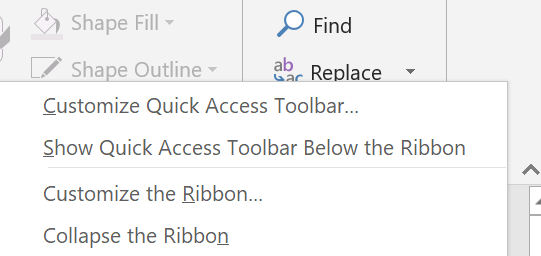
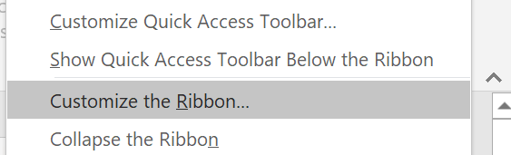
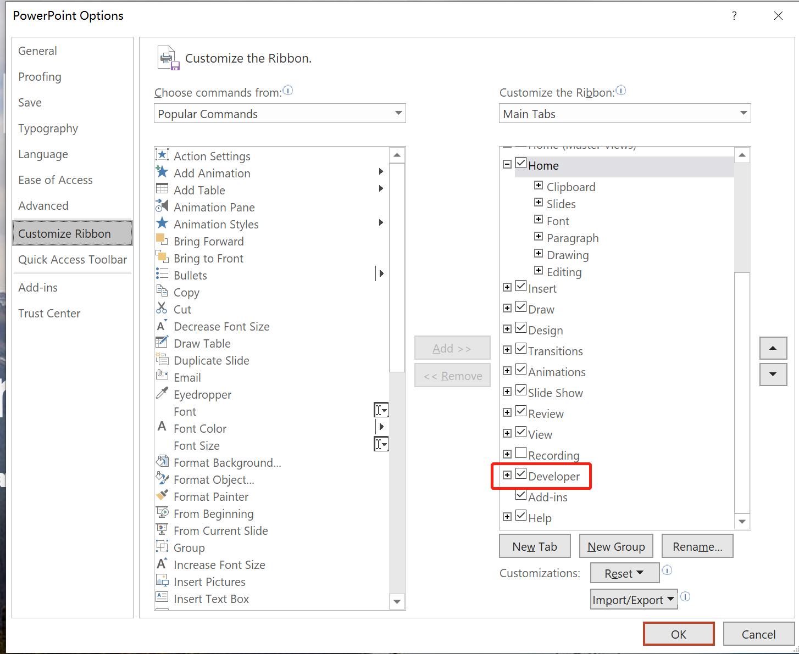
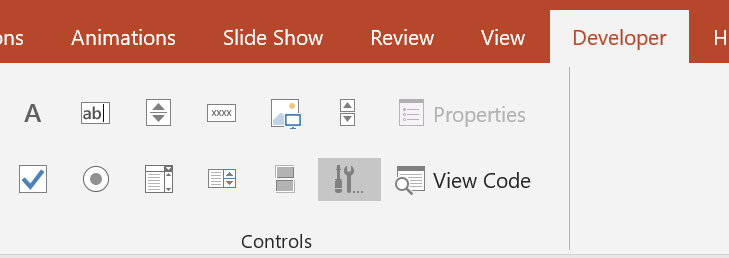
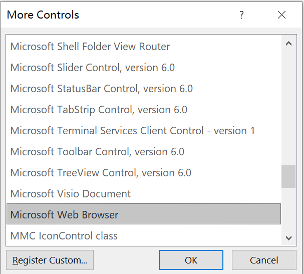
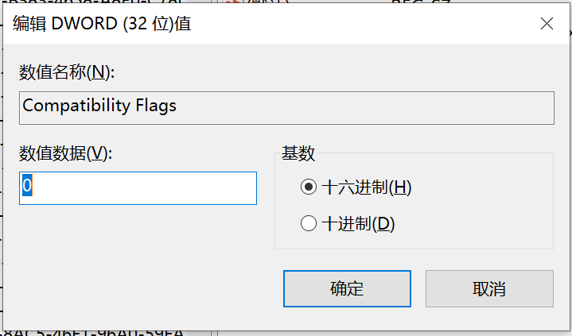
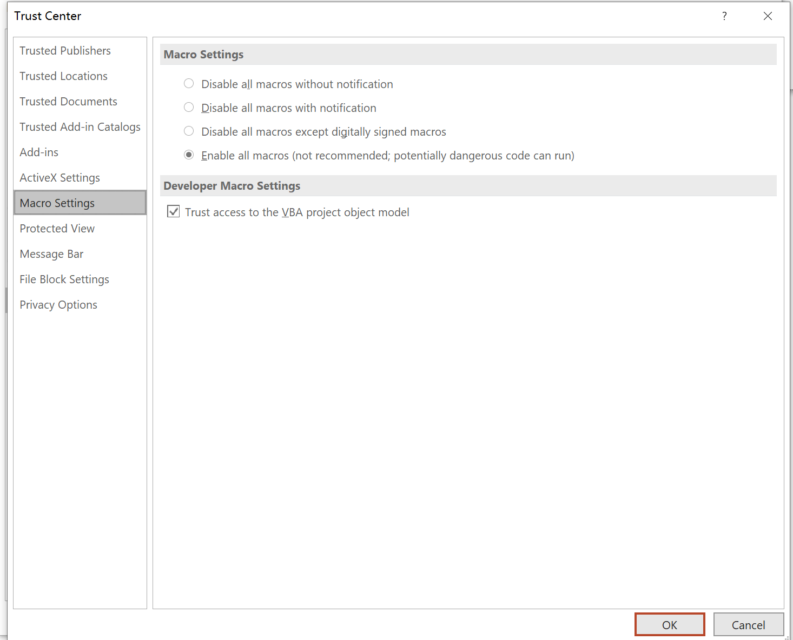

# How to insert website into Powerpoint without hyperlink

## Introduction

Sometimes people want to show some flasks or websites when they are doing presentation. Hyperlink is a good way to achieve these. However, the drawback of using hyperlink is that the computer will active another window to show the flask/website and inactive the presenting Powerpoint. It is inconvenient to continue the display of Powerpoint.

In this case, we are going to discuss how to use ActiveX and VBA to import flask/website into the Powerpoint.

## Tools

VBA, Regedit, Powerpoint

## Process

### Step 1

Right click the blank Toolbar and click the __Customize the Ribbon__

### Step 2

Open the window of PowerPoint Options and go to __Customize Ribbon__, tick the __Developer__ box.

### Step 3

Go to the __Developer__ toolbar and try to insert the __Microsoft Web Browser__ 

If an error __This ActiveX control cannot be inserted__ is raised up, Then go to __Step 4__; otherwise, go to __Step 5__

### Step 4

To solve the error in __Step 3__, we should change some values in __Registry__. Open the __Running Window__ by __Win + R__ and run __regedit__.

Go to __HKEY_LOCAL_MACHINE\SOFTWARE\Microsoft\Internet Explorer\ActiveX Compatibility\{8856F961-340A-11D0-A96B-00C04FD705A2}__ and set the value of __Compatibility Flags__ as 0

Go to __HKEY_LOCAL_MACHINE\SOFTWARE\Microsoft\Office\ClickToRun\REGISTRY\MACHINE\Software\Microsoft\Office\16.0\Common\COM Compatibility\{8856F961-340A-11D0-A96B-00C04FD705A2}__ and set the value of __Compatibility Flags__ as 0

Now, the __Microsoft Web Browser__ can be inserted but it is blank.

### Step 5

Insert a __Toggle Button__ from __Developer ActiveX Control__ toolbar.

Double click the inserted button and open the VBA window.

Insert the __WebBrowser1.Navigate()__ funtion and enter the website link into the function.

### Step 6

Open the __PowerPoint Option__ and go to __Trust Center__.

Open the __Trust Center Settings__ and enable the __all Macro Settings__ 

## Finish
